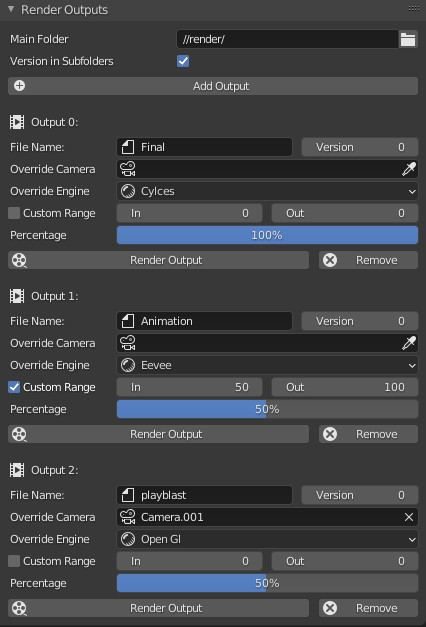

# Output Selector - Addon

This addon provides functionality to define multiple render outputs and render them with a single click.  The property panel is found under *Output Propertys>Render Outputs*. You can set **subfolders**, **camera overrides** and decide if the output should use the **opengl** render engine.

Each render output is rendered to the *Output Folder* following a subfolder named like the *Filename*.

Based on the image above, the output structure will be:

- blender_file.blend

- render/

  - ogl/

    - ogl_0001jpg
    - ...

  - v001/

    - v001_0001.jpg
    - ...

  - v002/

    - v002_0001.jpg
    - ...

## TODO

- [x] Prompt if you want to overwrite already rendered files 
- [x] Custom in and out points
- [x] Select render engine
- [ ] Select filetype
- [x] Custom version per output
- [x] Restore original output properties after render
- [ ] Playback rendered frames
